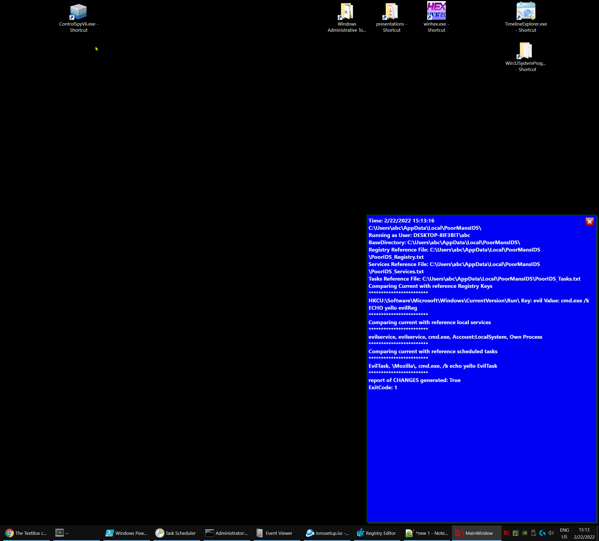
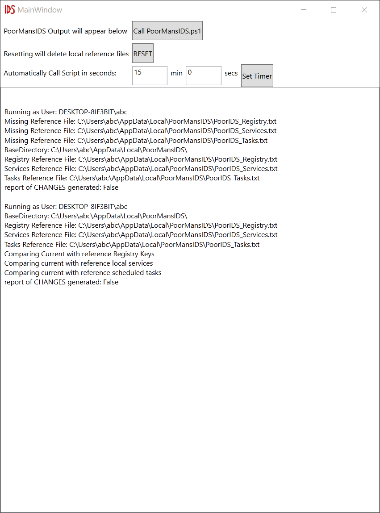

# PoorMansIDS
## Windows Intrusion Detection System: detect changes in *Registry Keys*, *Services*, *Scheduled Tasks*
### Tray-Icon App which starts with Windows ( Registry Run Key )
### includes setup file to install locally for every user and adds the Registry Key

## made of two components:
- PowerShellScript which create local reference files
- WPF App which calls the PS script periodically (like every 15 minutes)

### if it detects changes a blue box pops up in the bottom right corner of your screen: 

## Main Window
# double click on the IDS TrayIcon to:
1. call the script
1. reset reference files
1. set timer to different value

## right click on tray-icon -> exit

## setup instructions

- compile
- copy PoorMansIDS.ps1 in the same directory as PoorMansIDS.exe
- start
- see setup_src on how-to create a setup.exe installer with InnoSetup
